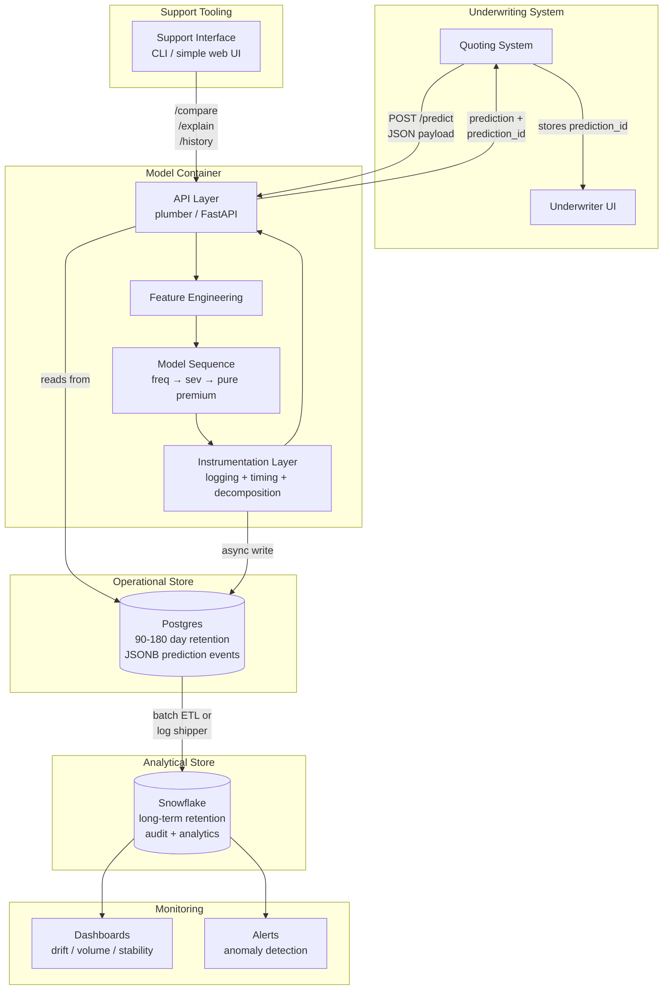
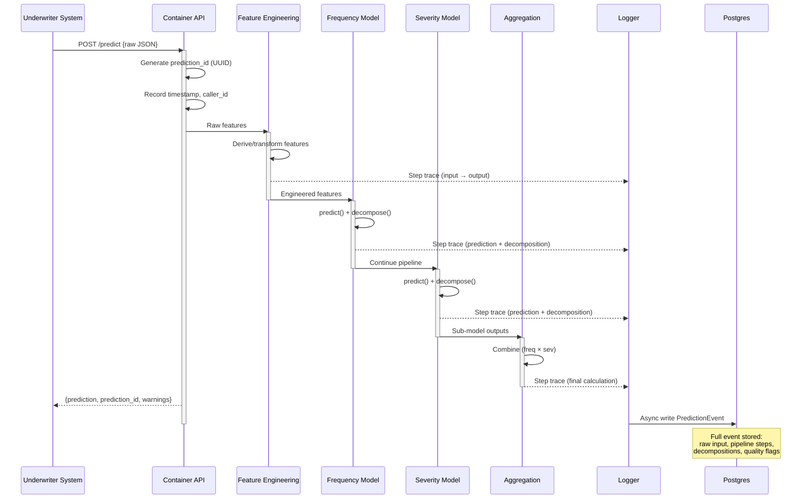
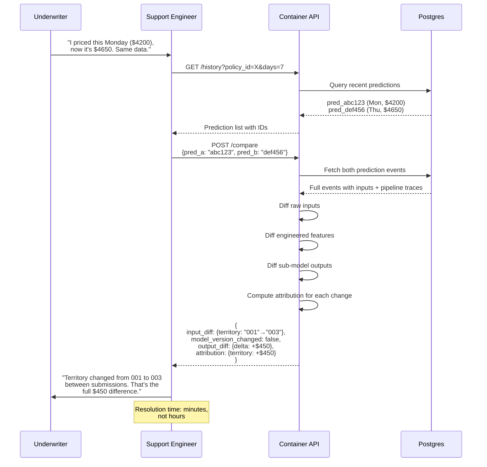
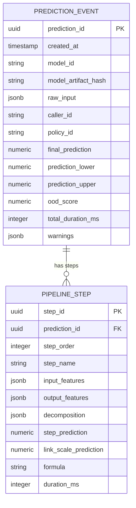
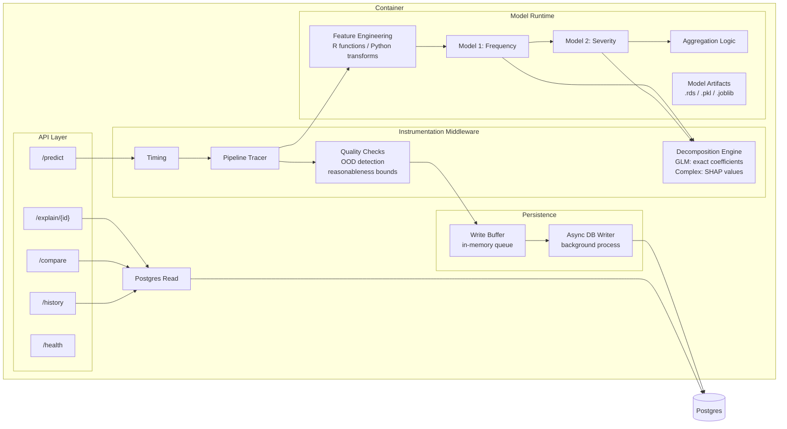
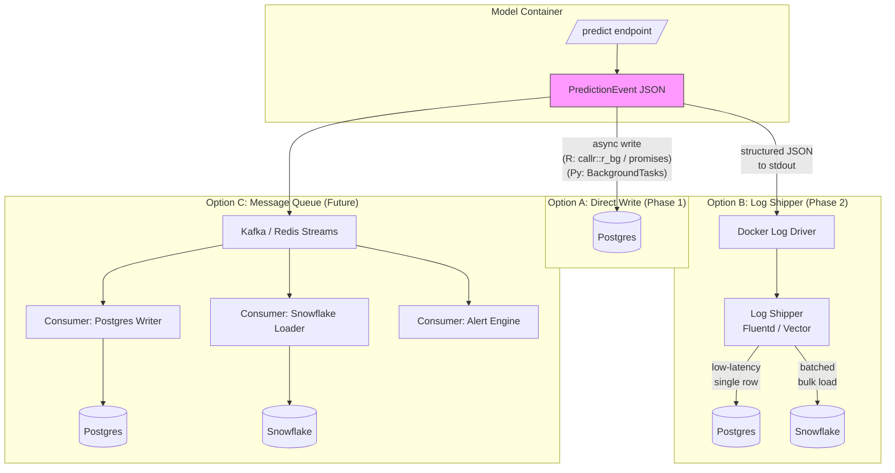
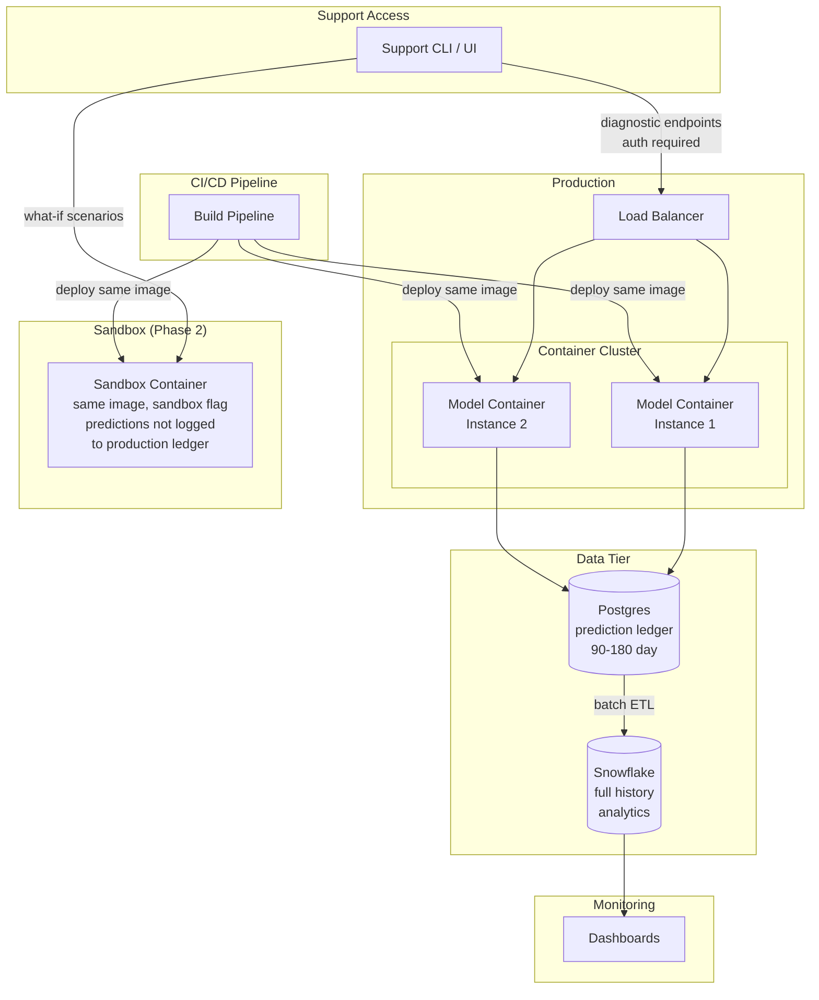
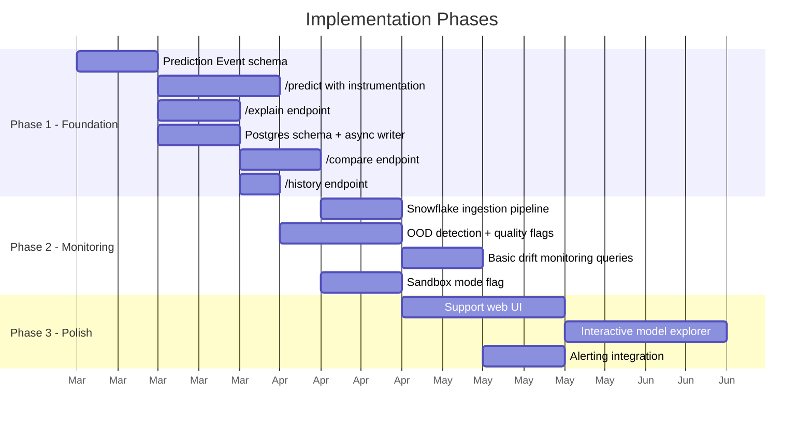

# Model Verification Architecture: Diagrams

## Status: Active Design Document

**Date**: 2026-02-21
**Companion to**: `mlops_model_verification_discussion.md`

---

## 1. High-Level System Architecture

---

## 2. Request Flow: `/predict`

---

## 3. Support Workflow: `/compare`

---

## 4. Prediction Event Data Model

---

## 5. Container Internal Architecture

---

## 6. Dual-Destination Logging Architecture

---

## 7. `/compare` Attribution Logic

```mermaid
graph TB
    subgraph "Input: Two Prediction Events"
        A[Prediction A<br/>Monday, $4200]
        B[Prediction B<br/>Thursday, $4650]
    end

    subgraph "Step 1: Input Diff"
        DIFF[Compare raw_input fields<br/>field by field]
        A --> DIFF
        B --> DIFF
        DIFF --> CHANGED[Changed fields:<br/>territory: 001 → 003]
        DIFF --> SAME[Unchanged fields:<br/>class_code, exposure, ...]
    end

    subgraph "Step 2: Check Model Version"
        VCHECK{Same model<br/>version?}
        CHANGED --> VCHECK
        VCHECK -->|Yes| ATTR
        VCHECK -->|No| VDIFF[Model version also<br/>contributes to delta]
        VDIFF --> ATTR
    end

    subgraph "Step 3: Attribution"
        ATTR[Compute contribution<br/>of each changed input]

        GLM_PATH[GLM Path:<br/>Exact coefficient difference<br/>exp&#40;beta_new&#41; / exp&#40;beta_old&#41;]
        COMPLEX_PATH[Complex Model Path:<br/>SHAP value difference<br/>between the two predictions]

        ATTR --> GLM_PATH
        ATTR --> COMPLEX_PATH
    end

    subgraph "Output"
        RESULT["input_diff: {territory: 001→003}<br/>model_changed: false<br/>delta: +$450<br/>attribution: {territory: +$450}"]
    end

    GLM_PATH --> RESULT
    COMPLEX_PATH --> RESULT
```

---

## 8. Deployment Topology (Target State)

---

## 9. Phase Roadmap

---

## Notes

- All diagrams use Mermaid syntax and can be rendered in GitHub, VS Code, Quarto, or any Mermaid-compatible viewer.
- Diagrams reflect the **target state** architecture. Implementation will be iterative per the phase roadmap.
- See companion document `mlops_model_verification_discussion.md` for full design rationale, Q&A history, and decision log.
